# Proyecto SQL: Análisis de Retención Bancaria y Fuga de Clientes en ABC Multinational Bank

## Resumen
Actualmente, **ABC Multinational Bank** busca asegurar la longevidad de su negocio mediante la mitigación del abandono de cuentas (*customer churn*). El objetivo principal de este proyecto es analizar los datos históricos de los cuentahabientes utilizando **SQL** en **SQL Server Management Studio (SSMS)**, con la finalidad de identificar patrones demográficos, evaluar el impacto de sus productos financieros y calcular con precisión el capital total en riesgo debido a la fuga de clientes.

---

## Estructura del Proyecto
* [Sobre los Datos](#sobre-los-datos)
* [Tareas y Preguntas de Negocio](#tareas-y-preguntas-de-negocio)
* [Limpieza y Validación de Datos](#limpieza-y-validación-de-datos)
* [Análisis Exploratorio de Datos (EDA) e Insights](#análisis-exploratorio-de-datos-eda-e-insights)

---

## Sobre los Datos
El conjunto de datos original, junto con el planteamiento del negocio de predicción de abandono, se encuentra disponible en [Kaggle - Bank Churn Dataset](https://www.kaggle.com/datasets/rangalamahesh/bank-churn?resource=download).

La información se consolidó en la tabla principal llamada `train` que captura las variables financieras y demográficas de miles de registros de ABC Multinational Bank. Las columnas clave utilizadas en este análisis son:

| Columna | Descripción |
|---|---|
| `Id_cliente` | Identificador único de cada usuario |
| `Puntaje_Crediticio` | Calificación del historial de crédito del cliente |
| `País / Género / Edad` | Atributos demográficos esenciales de la cartera |
| `Tenencia` | Años de permanencia de los clientes en el banco |
| `Balance` | Capital custodiado en la cuenta bancaria |
| `Numero_Producto` | Cantidad de productos financieros activos contratados |
| `Tiene_Tarjeta` | Indicador de posesión de tarjeta de crédito (Si / No) |
| `Miembros` | Estado de actividad de la cuenta (Activo / Inactivo) |
| `Salario` | Ingreso anual estimado del cliente |
| `Estado_Cliente` | Estado de retención final (Fidelizado / Abandona) |
| `Clasificacion_Credito` | Segmentación cualitativa del perfil crediticio |

---

## Tareas y Preguntas de Negocio
En este análisis, ayudo a responder 15 preguntas estratégicas de negocio orientadas a la retención y control de pérdidas del banco:

1. **Métricas de Control Macro:** Volumen total de registros, clientes únicos y saldo acumulado global.
2. **Distribución Geográfica:** Volumen de clientes y conteo de fugas agrupados por país.
3. **Análisis de Ingresos por Género:** Salarios mínimos, máximos y promedios por género.
4. **Filtros de Riesgo Extremo:** Clientes de Francia y España con puntajes críticos que ya abandonaron.
5. **Auditoría de Clientes de la Tercera Edad:** Identificación de clientes mayores de 60 años inactivos.
6. **Métricas por Perfil de Crédito:** Volumen total de clientes por categoría de Clasificación de Crédito.
7. **Impacto de Productos en la Fuga:** Porcentaje exacto de abandono según cantidad de productos activos.
8. **Análisis de Permanencia Crítica:** Años de tenencia que superan las 3,000 fugas utilizando `HAVING`.
9. **Rango Salarial de Abandono:** Máximos, mínimos y promedios de sueldos según permanencia de clientes retirados.
10. **Comportamiento Crediticio:** Promedio de saldo y puntaje de crédito por clasificación.
11. **Top VIP Fugados:** Ranking de los 3 saldos más altos de clientes que abandonaron por país usando `ROW_NUMBER`.
12. **Desviación Regional de Saldos:** Saldo individual vs. promedio global de su país usando CTEs e `INNER JOIN`.
13. **Riesgo por Volumen de Productos:** Relación entre productos activos, saldos perdidos y puntajes promedio.
14. **Cruce de Clientes de Alta Prioridad:** Perfiles excelentes con saldos superiores a 150,000 mediante `INTERSECT`.
15. **Reporte Gerencial Maestro:** Indicadores macro consolidados del capital total perdido.

---

## Limpieza y Validación de Datos
Antes de ejecutar las consultas analíticas, los datos pasaron por un proceso de preparación previo. La columna original que medía la fuga contenía valores binarios (`0` y `1`), estandarizados de la siguiente manera:
- Los registros con valor `0` fueron transformados a **`'Fidelizado'`**.
- Los registros con valor `1` fueron transformados a **`'Abandona'`**.

```sql
-- Verificar la existencia de valores nulos en el campo clave
SELECT COUNT(*) 
FROM train
WHERE Id_cliente IS NULL;

-- Validar los estados limpios presentes en la columna de control
SELECT DISTINCT Estado_Cliente 
FROM train;
```

---

## Análisis Exploratorio de Datos (EDA) e Insights

---

### Pregunta #1: ¿Cuál es el volumen total de registros, el total de clientes únicos y el saldo acumulado global?

Calculé las métricas macro de control utilizando `COUNT(Id_cliente)` para el volumen bruto, `COUNT(DISTINCT Id_cliente)` para aislar cuentahabientes únicos y `SUM(Balance)` para consolidar el capital total custodiado.

```sql
SELECT 
    COUNT(Id_cliente) AS total_de_registros,
    COUNT(DISTINCT Id_cliente) AS total_clientes_unicos,
    SUM(Balance) AS saldo_acumulado
FROM train;
```

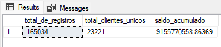

**Insight:** Este análisis inicial permite dimensionar el tamaño absoluto del banco y establece la línea base de capital financiero total bajo administración antes de evaluar el impacto de las fugas.

---

### Pregunta #2: ¿Cuál es la distribución de clientes y el conteo de abandono por cada país?

Agrupé los datos con `GROUP BY País` y empleé `SUM(CASE WHEN...)` para contabilizar exactamente cuántos clientes están en estado `'Abandona'`, ordenando de mayor a menor con `ORDER BY Total_Fugados DESC`.

```sql
SELECT 
    País,
    COUNT(DISTINCT Id_cliente) AS Total_Clientes,
    SUM(CASE WHEN Estado_Cliente = 'Abandona' THEN 1 ELSE 0 END) AS Total_Fugados
FROM train
GROUP BY País
ORDER BY Total_Fugados DESC;
```

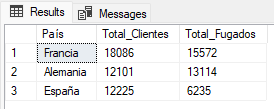

**Insight:** Identifica qué mercados regionales presentan las tasas de deserción más severas, permitiendo enfocar presupuestos y campañas de retención en las sucursales más críticas.

---

### Pregunta #3: ¿Cuál es el salario mínimo, máximo y promedio redondeado por cada género?

Utilicé `MIN(Salario)` y `MAX(Salario)` para auditar los rangos extremos de ingresos, y `ROUND(AVG(Salario), 0)` para obtener un promedio limpio sin decimales por género.

```sql
SELECT 
    Género,
    MIN(Salario) AS salario_minimo,
    MAX(Salario) AS salario_maximo,
    ROUND(AVG(Salario), 0) AS salario_promedio
FROM train
GROUP BY Género;
```

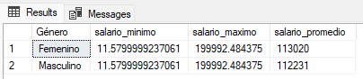

**Insight:** Permite comprender el perfil socioeconómico de los clientes por género, sirviendo de base para el diseño de productos financieros personalizados.

---

### Pregunta #4: Clientes de Francia/España con Puntaje_Crediticio entre 350 y 500 que ya abandonaron

Implementé un filtro complejo combinando `IN ('Francia', 'España')` con `BETWEEN 350 AND 500` para aislar clientes con perfil de crédito de altísimo riesgo que finalizaron su relación con el banco.

```sql
SELECT Id_cliente, Apellido, País, Puntaje_Crediticio, Salario
FROM train
WHERE País IN ('Francia', 'España') 
  AND Puntaje_Crediticio BETWEEN 350 AND 500 
  AND Estado_Cliente = 'Abandona';
```

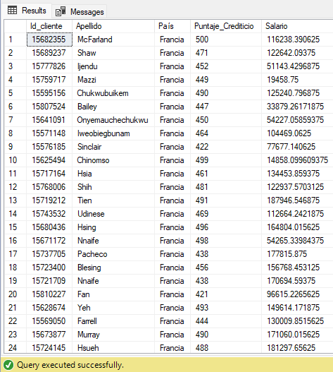

**Insight:** Expone las cuentas de países principales con calificaciones de crédito deficientes que terminaron en abandono, ayudando a calibrar los modelos de asignación de créditos.

---

### Pregunta #5: IDs de clientes únicos mayores de 60 años que sean miembros inactivos

Usé `SELECT DISTINCT` para garantizar unicidad y apliqué filtros con `Edad > 60` y `Miembros = 'Inactivo'`, ordenando por `ORDER BY Edad DESC`.

```sql
SELECT DISTINCT Id_cliente, Apellido, Edad, Miembros
FROM train
WHERE Edad > 60 
  AND Miembros = 'Inactivo'
ORDER BY Edad DESC;
```

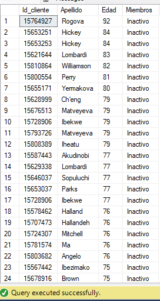

**Insight:** Identifica al segmento de la tercera edad con nula interacción con sus cuentas, representando alta vulnerabilidad latente para la deserción institucional.

---

### Pregunta #6: Conteo de clientes totales por categoría de Clasificación de Crédito

Agrupé la cartera por `Clasificacion_Credito` y ejecuté `COUNT(*)`, ordenando de forma descendente para mapear las categorías con mayor densidad de registros.

```sql
SELECT 
    Clasificacion_Credito,
    COUNT(*) AS cantidad_clientes
FROM train
GROUP BY Clasificacion_Credito
ORDER BY cantidad_clientes DESC;
```

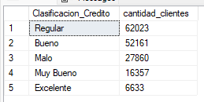

**Insight:** Ofrece una radiografía del estado de salud de riesgo del banco, permitiendo verificar si la mayoría de usuarios posee perfiles de crédito estables o de cuidado.

---

### Pregunta #7: Porcentaje exacto de abandono por cada cantidad de productos financieros contratados

Desarrollé un cálculo de participación porcentual aplicando casteo implícito a valores flotantes dentro de `SUM(CASE WHEN...)`, multiplicado por 100 y redondeado con `ROUND()`.

```sql
SELECT 
    Numero_Producto,
    COUNT(*) AS Total_Clientes,
    SUM(CASE WHEN Estado_Cliente = 'Abandona' THEN 1 ELSE 0 END) AS Clientes_Fugados,
    ROUND((SUM(CASE WHEN Estado_Cliente = 'Abandona' THEN 1.0 ELSE 0.0 END) / COUNT(*)) * 100, 2) AS Porcentaje_Fuga
FROM train
GROUP BY Numero_Producto
ORDER BY Numero_Producto;
```

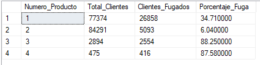

**Insight:** Revela si la contratación de múltiples productos financieros incrementa la lealtad del cliente o si la saturación operativa eleva el porcentaje de abandono.

---

### Pregunta #8: Grupos de permanencia donde el conteo de abandonos supere las 3,000 fugas

Implementé `HAVING` para filtrar grupos de tenencia que superen el umbral crítico de 3,000 fugas, obligando al motor a calcular el total de fugados por grupo antes de filtrar.

```sql
SELECT 
    Tenencia,
    SUM(CASE WHEN Estado_Cliente = 'Abandona' THEN 1 ELSE 0 END) AS Total_Fugados
FROM train
GROUP BY Tenencia
HAVING SUM(CASE WHEN Estado_Cliente = 'Abandona' THEN 1 ELSE 0 END) > 3000
ORDER BY Tenencia;
```

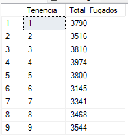

**Insight:** Muestra los años de antigüedad donde el banco sufre las mayores pérdidas masivas de usuarios, permitiendo programar alertas tempranas de fidelización.

---

### Pregunta #9: Rango salarial de clientes que abandonaron según sus años de permanencia

Aislé mediante `WHERE` únicamente las cuentas perdidas y extraje simultáneamente `MAX(Salario)`, `MIN(Salario)` y `AVG(Salario)` agrupados por cada año de `Tenencia`.

```sql
SELECT 
    Tenencia,
    COUNT(*) AS Total_Clientes,
    MAX(Salario) AS Salario_Maximo,
    MIN(Salario) AS Salario_Minimo,
    AVG(Salario) AS Salario_Promedio
FROM train
WHERE Estado_Cliente = 'Abandona'
GROUP BY Tenencia
ORDER BY Tenencia;
```

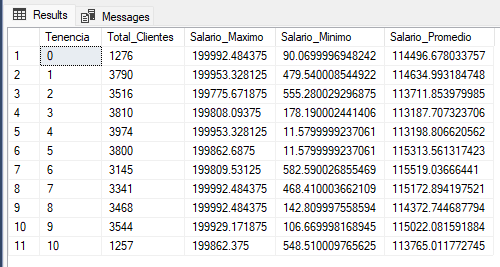

**Insight:** Evalúa si el poder adquisitivo de los clientes que se retiran varía según el tiempo en el banco, determinando el nivel socioeconómico del segmento en fuga.

---

### Pregunta #10: Relación del promedio de saldo y puntaje de crédito por cada clasificación

Agrupé por `Clasificacion_Credito` para calcular `AVG(Balance)` y `AVG(Puntaje_Crediticio)`, ordenando de mayor a menor volumen de saldo acumulado.

```sql
SELECT 
    Clasificacion_Credito,
    COUNT(*) AS Total_Clientes,
    AVG(Balance) AS Balance_Promedio,
    AVG(Puntaje_Crediticio) AS Puntaje_Promedio
FROM train
GROUP BY Clasificacion_Credito
ORDER BY AVG(Balance) DESC;
```

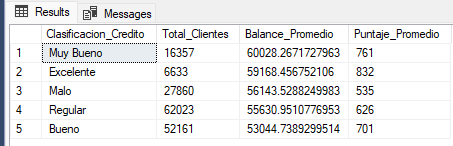

**Insight:** Vincula la calificación crediticia con la liquidez real depositada, identificando qué tan rentables son los grupos de clientes según su perfil.

---

### Pregunta #11: Ranking de los 3 saldos más altos de clientes que abandonaron por país (ROW_NUMBER)

Diseñé una CTE y apliqué `ROW_NUMBER() OVER (PARTITION BY País ORDER BY Balance DESC)` para enumerar los saldos más altos de cuentas en riesgo, filtrando posiciones menores o iguales a 3.

```sql
WITH ranking_saldos AS (
    SELECT 
        Id_cliente,
        Apellido,
        País,
        Balance,
        ROW_NUMBER() OVER (PARTITION BY País ORDER BY Balance DESC) AS posicion
    FROM train
    WHERE Estado_Cliente = 'Abandona'
)
SELECT Id_cliente, Apellido, País, Balance, posicion
FROM ranking_saldos
WHERE posicion <= 3;
```

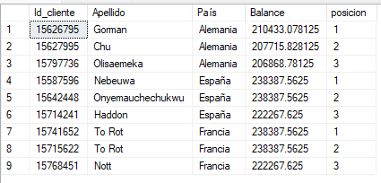

**Insight:** Expone las cuentas VIP de mayor capital que se retiraron del banco, facilitando auditorías profundas sobre cuentas corporativas o patrimoniales.

---

### Pregunta #12: Comparación del saldo individual contra el promedio global de su país (CTE + INNER JOIN)

Construí una CTE para precalcular el saldo promedio por región y realicé un `INNER JOIN` usando `País` como llave, aplicando `ROUND()` para medir desviaciones individuales.

```sql
WITH saldos_por_pais AS (
    SELECT 
        País AS pais_tabla,
        AVG(Balance) AS balance_promedio
    FROM train
    GROUP BY País
)
SELECT TOP 100
    Id_cliente,
    Apellido,
    País,
    Balance,
    ROUND(balance_promedio, 2) AS Balance_Promedio_Pais,
    ROUND(Balance - balance_promedio, 2) AS Diferencia_Individual
FROM train
INNER JOIN saldos_por_pais ON País = pais_tabla;
```

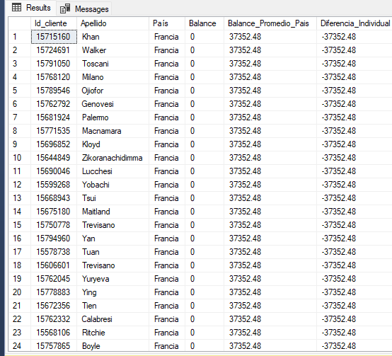

**Insight:** Permite analizar la distancia financiera de cada cuentahabiente en relación con la riqueza promedio de su propio contexto macroeconómico regional.

---

### Pregunta #13: Riesgo de fuga, saldos totales perdidos y puntajes promedio según productos activos

Aislé la población en deserción verificada y apliqué funciones analíticas agrupando por `Numero_Producto`, calculando el capital total perdido con `SUM(Balance)`.

```sql
SELECT 
    Numero_Producto,
    COUNT(*) AS Total_Clientes,
    AVG(Puntaje_Crediticio) AS Puntaje_Promedio,
    SUM(Balance) AS Balance_Total_Perdido
FROM train
WHERE Estado_Cliente = 'Abandona'
GROUP BY Numero_Producto;
```

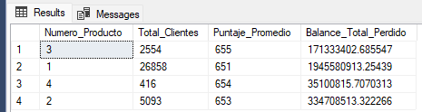

**Insight:** Cuantifica qué volumen específico de productos financieros concentró las mayores fugas de capital absoluto tras el retiro voluntario de las cuentas.

---

### Pregunta #14: Clientes con perfil financiero excelente y alta liquidez (INTERSECT)

Implementé `INTERSECT` para cruzar dos consultas independientes: la primera extrae cuentas con `Puntaje_Crediticio > 750` y la segunda filtra `Balance > 150000`, devolviendo únicamente las filas coincidentes.

```sql
SELECT Id_cliente FROM train WHERE Puntaje_Crediticio > 750
INTERSECT
SELECT Id_cliente FROM train WHERE Balance > 150000;
```

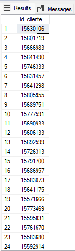

**Insight:** Consolida un listado depurado de clientes de más alto valor estratégico que cumplen simultáneamente con excelente comportamiento de pago y alta liquidez depositada.

---

### Pregunta #15: Reporte Gerencial Maestro — KPI Consolidado Final de Pérdidas Bancarias

Unifiqué las métricas directivas en una sola consulta macro, calculando clientes únicos con `COUNT(DISTINCT Id_cliente)` y el impacto total de pérdidas con `SUM(CASE WHEN Estado_Cliente = 'Abandona' THEN Balance ELSE 0 END)`.

```sql
SELECT 
    COUNT(DISTINCT Id_cliente) AS Total_Clientes_Unicos,
    SUM(CASE WHEN Estado_Cliente = 'Abandona' THEN Balance ELSE 0 END) AS Total_Capital_Perdido,
    AVG(Salario) AS Salario_Promedio_General
FROM train;
```

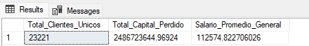

**Insight:** Presenta el dato financiero más crítico para los altos directivos: el costo monetario real que representó la fuga de clientes, fundamentando la toma de decisiones estratégicas de retención.